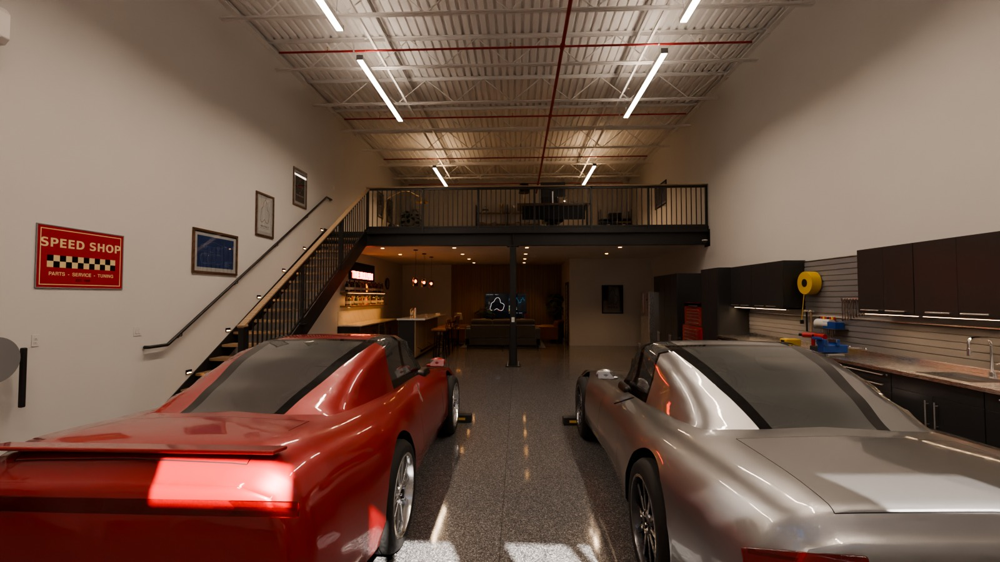
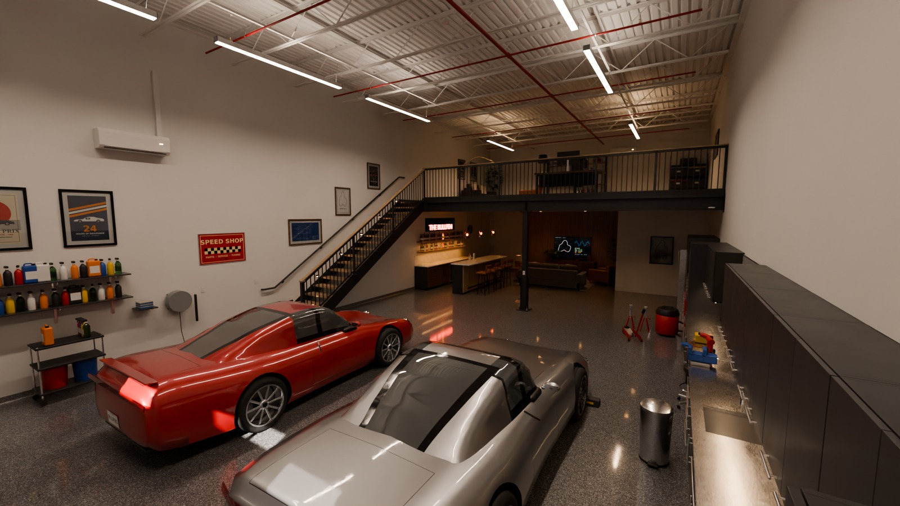
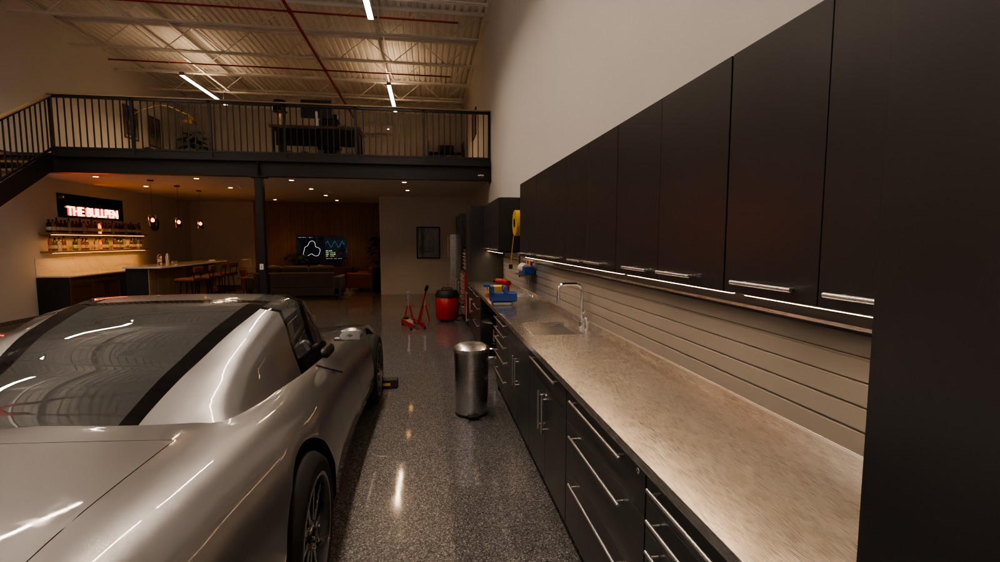
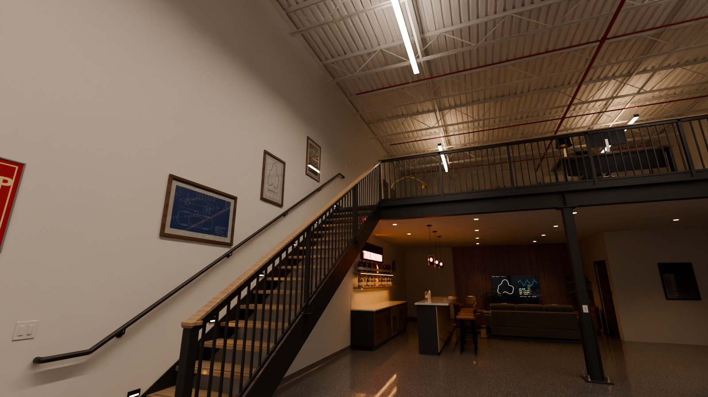
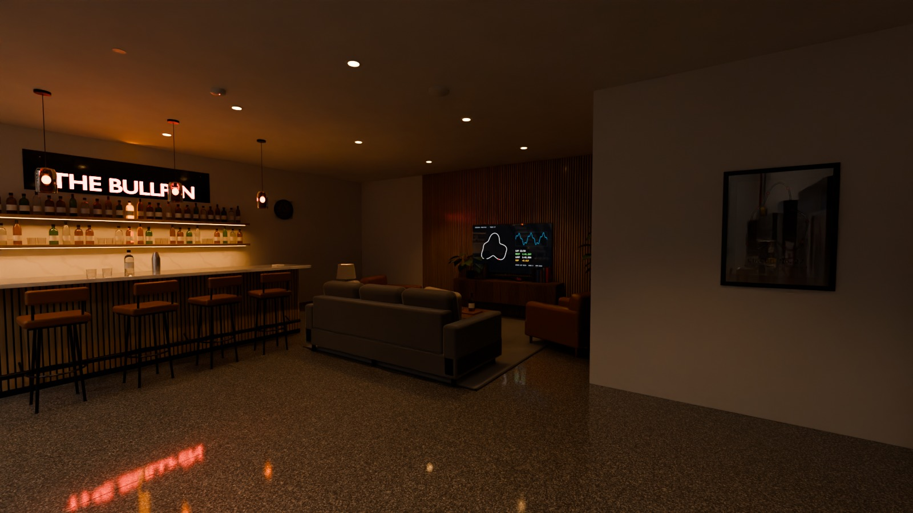
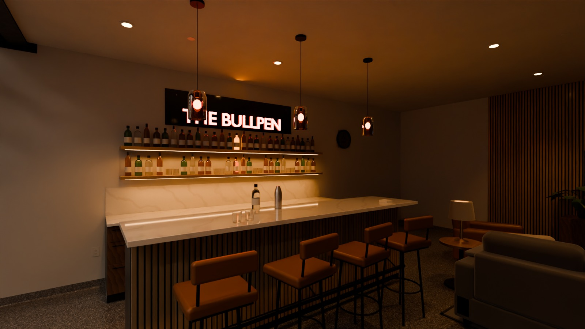
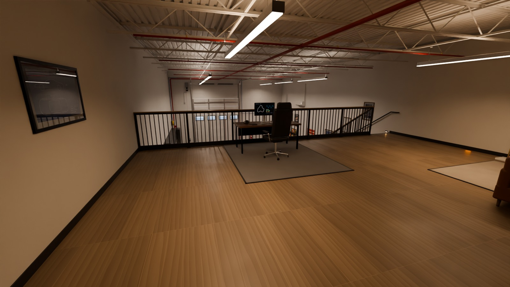
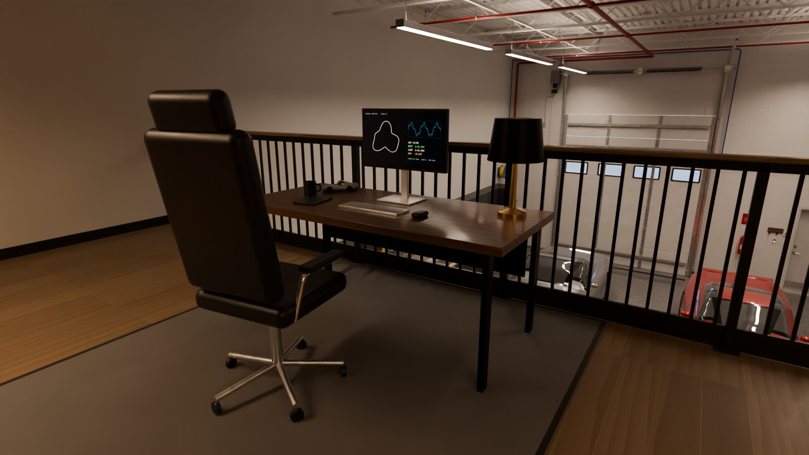
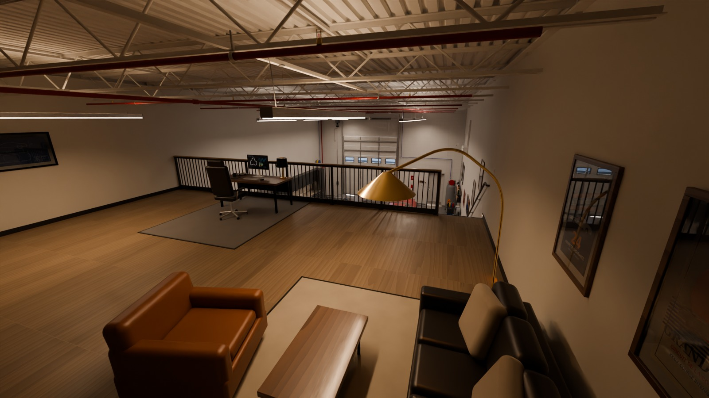

# The Bullpen: procedural Blender reconstruction

A Python-built Blender scene of a luxury garage condo with a mezzanine, after
"Tour The Most Amazing Luxury Garage Car Condo | The Bullpen"
(https://youtu.be/uDjZLU8gtjk).

> **Accuracy status.** The build environment could not reach YouTube, so I
> never watched the video. The layout comes from published WheelHouse
> garage-condo specs (14 ft insulated overhead door, steel man door, 6 in
> slab, mezzanine-ready, sprinklers, 200 A service, RV outlet) and from the
> features named in the brief (central post under the mezzanine, cabinet
> walls, workshop, lounge, bar, mezzanine office). Everything else is a
> documented assumption. See `RECONSTRUCTION_PLAN.md`; every value marked
> `ASSUMPTION` is in `bullpen/config.py`. To refit it to the real garage,
> edit those values against video frames and rebuild.

## Contents

| Path | What |
|---|---|
| `build_bullpen.py` | Entry point. Builds the whole scene, saves the `.blend`, optionally renders. |
| `bullpen/config.py` | All dimensions, layout and style parameters (assumptions are flagged). |
| `bullpen/core.py` | Collections, naming, bevelled boxes, lathe, sweep and pipe, prism, text, UVs, linked duplicates. |
| `bullpen/materials.py` | Procedural PBR library (~110 materials) with imperfection layers. |
| `bullpen/architecture.py` | Slab with saw-cut joints, cove base, walls, bar-joist roof and deck, 14 ft door with high-lift track and opener, man door, bathroom, exterior. |
| `bullpen/structure.py` | W12 girder, **central HSS post** with base, cap and stiffeners, W8 joists, sprinkler system, mini-splits. |
| `bullpen/mezzanine.py` | Deck, LVP, fascia, soffit, guard system (pickets, glass or cable), steel stair with oak treads and handrails. |
| `bullpen/cabinets.py` | Modular steel cabinets: carcass, drawers, doors, pulls, locks, stainless top and sink, slatwall, uppers with LED. |
| `bullpen/workshop.py` | Tool chest, vise, compressor and blue aluminium air line, hose reels, jack and stands, shop vac, detailing station. |
| `bullpen/furniture.py` | Lounge (sofa, chairs, rug, coffee table, slatted TV wall, console), bar with stools, back-bar and neon sign, mezzanine office and lounge. |
| `bullpen/vehicles.py` | Two procedural placeholder cars at real size (no real makes): lofted bodies, boolean-cut arches and shut lines, wheels and brakes, lights, interiors. |
| `bullpen/props.py`, `decor.py`, `details.py` | Frames, plants, bottles, helmets, trophies; posters; panel, switches, outlets, RV outlet, extinguisher, drain, wheel stops. |
| `bullpen/lighting.py` | Modelled fixtures paired with physical lights (photometric lm to W), daylight. |
| `bullpen/cameras.py` | 9 cameras plus scale-reference empties and labels (`REFERENCE`, hidden in renders). |
| `tools/make_textures.py` | Regenerates the original poster, sign, TV, clock and plate artwork in `textures/`. |
| `tools/render_cameras.py` | Renders cameras from the saved `.blend` without rebuilding. |
| `tools/inspect_scene.py` | QA report: missing materials, empty meshes, non-unit scales, objects below the floor, floating assemblies, triangle count. |
| `reference/` | Drop video frames here to refit the layout (see its README). |
| `bullpen_garage.blend` | Built scene (textures packed). |
| `renders/` | Cycles renders from every camera. |

## Renders

Cycles, 1600 x 900, 96 samples with OpenImageDenoise, AgX (Medium High
Contrast). Views:

| | |
|---|---|
|  |  |
|  |  |
|  |  |
|  |  |
|  | |

Scene stats: about 4,800 objects, 680k triangles, 106 materials, 54 lights.
The `.blend` is about 5 MB with textures packed. A full build takes about
20 s; a render takes about 8 min per camera on 4 CPU cores.

## Build

```bash
# Blender 4.2+ (tested with Blender 5.0.1 via the bpy module)
blender --background --python build_bullpen.py -- --render all
# or, with `pip install bpy`:
python build_bullpen.py --render Camera_Entrance,Camera_Lounge --res 1920x1080 --samples 256
```

Options: `--out file.blend`, `--render all|names`, `--res WxH`, `--samples N`,
`--renders DIR`, `--only module,module` (for debugging), `--no-save`.

## Conventions

- Metric, unit scale 1, Z up. The origin is the floor at the middle of the
  front wall's interior face. +Y points into the unit.
- Objects keep scale (1, 1, 1). Every assembly is parented to a named empty
  (`Cabinet_04_Door2`, `Sofa_Main`, `Stair_Main`, ...), so it moves as a
  unit.
- Collections: `ARCHITECTURE`, `STRUCTURE`, `MEZZANINE`, `CABINETS`,
  `WORKSHOP`, `FURNITURE`, `AUTOMOTIVE`, `LIGHTING`, `DECOR`, `DETAILS`,
  `CAMERAS`, `REFERENCE`.
- Bevels are live Bevel modifiers with hardened normals. Repeated parts share
  mesh data.
- Every mesh has a metric box-projected `UVMap`. The procedural materials need
  baking before export to Unity or Unreal; the UVs are ready for that.
- Lights: Cycles. Blender watts are about lumens / 250. Emissive fixture
  faces are hidden from diffuse rays, so energy is not double counted.
